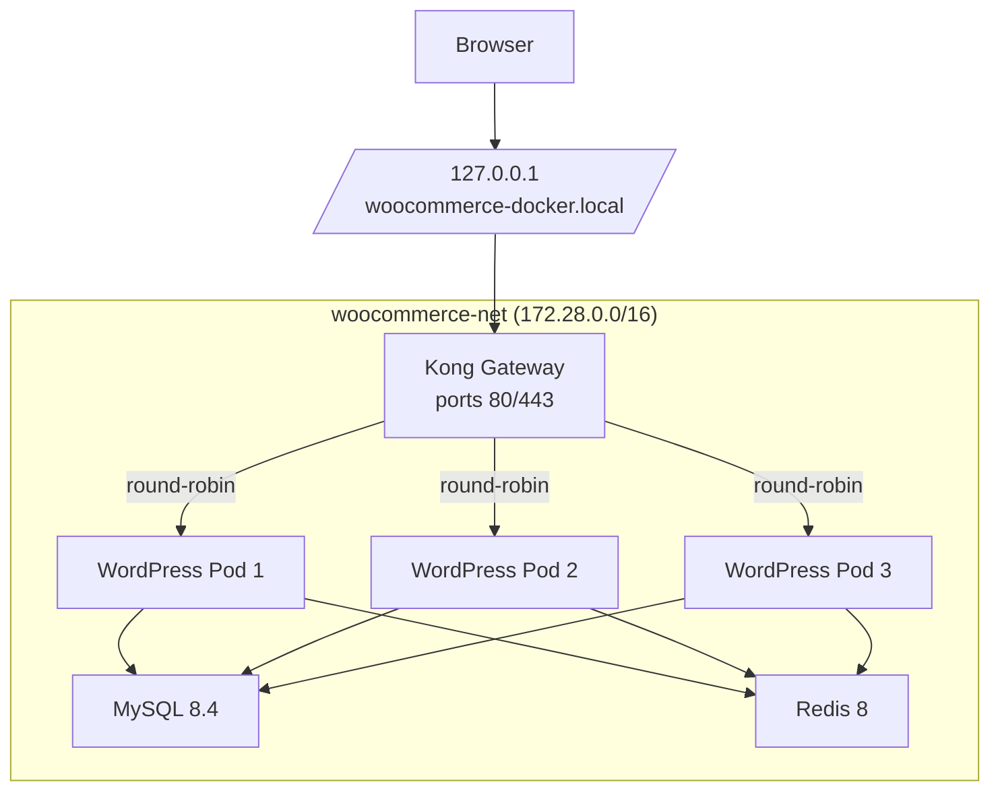

# woocommerce-docker

A containerized WordPress + WooCommerce stack with Kong Gateway, Redis, and horizontal scaling. Designed to replicate and fix duplicate order issues in load-balanced environments.

## Quick Start

```bash
# 1. Add DNS entry
echo "127.0.0.1 woocommerce-docker.local" | sudo tee -a /etc/hosts

# 2. Generate SSL certificates
./scripts/generate-certs.sh

# 3. Start the stack
docker-compose up -d

# 4. Access WordPress
open https://woocommerce-docker.local
```

## Initial Setup

The `data/` directory is not included in the repository. On first run:

### 1. Complete WordPress Installation

Visit `https://woocommerce-docker.local` and complete the WordPress setup wizard:

- **Site Title:** Your Store Name
- **Username:** `admin`
- **Password:** `password` (or your choice)
- **Email:** your@email.com (or your choice)

### 2. Activate Plugins

1. Go to **Plugins → Installed Plugins**
2. Activate **WooCommerce** — e-Commerce functionality
3. Activate **Query Monitor** — debugging & performance
4. Activate **Redis Object Cache** — object caching
5. Complete the WooCommerce setup wizard

### 3. Add Sample Products

1. Go to **WooCommerce → Home**
2. Click **Add products** → **Import sample products**
3. Or manually add a product via **Products → Add New**

### 4. Enable Redis Object Cache

1. Go to **Settings → Redis**
2. Click **Enable Object Cache**

### 5. Verify Kong Load Balancing

Use Query Monitor to confirm Kong's round-robin is distributing requests:

1. Click **Query Monitor** in the admin bar
2. Go to the **Request** tab
3. Find **`Remote IP`**
4. Refresh the page several times — the IP should rotate between pods

## Architecture



| Component | Details                                       |
| --------- | --------------------------------------------- |
| Kong      | DB-less gateway, round-robin load balancing   |
| WordPress | 3 replicas (scalable 3–8), shared Redis cache |
| MySQL     | 8.4, primary database                         |
| Redis     | 8, object cache for sessions/queries          |

## Duplicate Order Testing

This stack demonstrates the **race condition** that causes duplicate orders when concurrent checkout requests arrive simultaneously.

### The Problem

When multiple requests process the same cart at once (from AWS ALB retries, browser retries, or concurrent tabs), WooCommerce lacks atomic locking:

```
Request 1 → Check cart ✓ → Create Order #101
Request 2 → Check cart ✓ → Create Order #102 (DUPLICATE!)
Request 3 → Check cart ✓ → Create Order #103 (DUPLICATE!)
```

### The Fix

MySQL atomic locking via `GET_LOCK()` serializes concurrent requests. After acquiring the lock, we check if an order was created within the last 60 seconds with the same cart hash:

```
Request 1 → Acquire lock ✓ → Create Order #101 → Release lock
Request 2 → Acquire lock (waits) → Order exists → Blocked ✓
Request 3 → Acquire lock (waits) → Order exists → Blocked ✓
```

The 60-second window catches concurrent requests while allowing legitimate repeat orders (same product purchased again after 60+ seconds).

### Testing

The checkout page includes an interactive **Concurrent Checkout Test** panel to verify the fix dynamically:

1. Add a product to your cart and go to the checkout page.
2. Locate the test panel above the "Place Order" button.
3. Toggle the **Fix ON/OFF** switch in the panel header:
   - **Fix OFF**: Disables the atomic locking. A **0.5s delay** is injected to make race conditions easier to trigger.
   - **Fix ON**: Enables atomic locking. Duplicate requests will be blocked with a yellow ⚠️ warning.
4. Click **Run Concurrent Test** to see the results in real-time.

### Manual Reproduction (Browser Console)

On the checkout page, open browser DevTools (F12) and paste:

```javascript
const formData = new URLSearchParams(
  new FormData(document.querySelector("form.checkout"))
);
const requests = Array(5)
  .fill()
  .map(() =>
    fetch("/?wc-ajax=checkout", {
      method: "POST",
      headers: { "Content-Type": "application/x-www-form-urlencoded" },
      body: formData,
      credentials: "same-origin",
    }).then((r) => r.json())
  );
const results = await Promise.all(requests);
console.log("Order IDs:", results.map((r) => r.order_id).filter(Boolean));
// Expected (with fix): [101] — 1 order
// Actual (without fix): [101, 102, 103, 104, 105] — 5 duplicates!
```

### Configuration

The following constants can be configured in `wp-config.php` or `docker-compose.yml`:

```php
define( 'WC_CONCURRENT_CHECKOUT_TEST', true );       // Enable test panel on checkout
define( 'WC_CONCURRENT_CHECKOUT_REQUESTS', 5 );      // Number of concurrent requests to send
define( 'WC_DUPLICATE_ORDER_LOCKOUT_DURATION', 60 ); // Lockout duration in seconds (default 60)

// Optional: Hardcode the fix state.
// If defined here, the interactive UI toggle will be hidden.
define( 'WC_DUPLICATE_ORDER_FIX', true );
```

## Credentials

| Service    | URL / Host                                 | Credentials                   |
| ---------- | ------------------------------------------ | ----------------------------- |
| WordPress  | https://woocommerce-docker.local/wp-admin/ | admin / password              |
| MySQL      | host: `mysql`, db: `wordpress_db`          | wordpress / WpSecure@2026Pass |
| Redis      | host: `redis`, port: `6379`                | admin / password              |
| Kong Admin | http://localhost:8001                      | —                             |

## Autoscaling

CPU-based horizontal scaling (3–8 replicas):

```bash
./autoscale.sh
```

- Scales up if CPU > 50%
- Scales down if CPU < 10%
- Edit thresholds in `autoscale.sh`

## Troubleshooting

### Site Unreachable

1. **Verify DNS entry** in `/etc/hosts`:

   ```bash
   grep woocommerce-docker.local /etc/hosts
   # Should show: 127.0.0.1 woocommerce-docker.local
   ```

2. **Flush DNS cache** (macOS):

   ```bash
   sudo dscacheutil -flushcache && sudo killall -HUP mDNSResponder
   ```

3. **Always use HTTPS** — `https://woocommerce-docker.local`

### Ring-Balancer Errors

Restart Kong if WordPress pods changed:

```bash
docker-compose restart kong
```

### SSL Certificate

This stack uses self-signed SSL certificates. To remove browser warnings:

**1. Generate certificates** (if not already present):

```bash
./scripts/generate-certs.sh
```

**2. Add to macOS Keychain** (trusts the certificate system-wide):

```bash
sudo security add-trusted-cert -d -r trustRoot \
  -k /Library/Keychains/System.keychain \
  certs/cert.pem
```

**3. Restart Kong**:

```bash
docker-compose restart kong
```

**4. Restart browser** and visit `https://woocommerce-docker.local`

> **Note:** If you skip step 2, browsers will show a warning. Click "Advanced" → "Proceed" to continue.

## Files

| File                               | Purpose                      |
| ---------------------------------- | ---------------------------- |
| `docker-compose.yml`               | Service definitions          |
| `kong.yml`                         | Kong declarative config      |
| `Dockerfile.wordpress`             | WordPress image build        |
| `autoscale.sh`                     | CPU-based scaling script     |
| `scripts/generate-certs.sh`        | SSL certificate generator    |
| `scripts/wp-init.sh`               | WordPress initialization     |
| `wordpress/wp-content/mu-plugins/` | Duplicate order fix & tester |

## Commands

```bash
# Start
docker-compose up -d

# Rebuild WordPress image
docker-compose up --build -d

# View logs
docker-compose logs -f kong
docker-compose logs -f wordpress

# Restart services
docker-compose restart wordpress
docker-compose restart kong

# Scale manually
docker-compose up -d --scale wordpress=5

# Stop
docker-compose down
```

## Tested With

| Component    | Version |
| ------------ | ------- |
| WooCommerce  | 10.4    |
| WordPress    | 6.9     |
| Kong Gateway | 3.9     |
| MySQL        | 8.4     |
| Redis        | 8       |
| PHP          | 8.3     |
